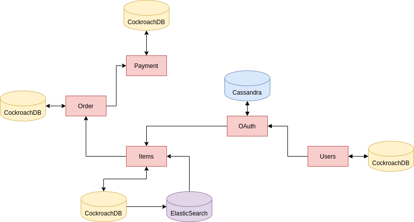

I am assuming that you have landed here for one of the following two reasons:

- To learn how to create applications with microservice architecture
- To sharpen your microservices skills a bit further

So let's cut chase right into the subject domain.

### The Crux of the Problem

So far, you might have been developing monolithic applications in which everything is tightly-coupled. By tightly-coupled, what I am exactly meaning is that either everything will work or it won't work at all. Even though some parts or most parts of your application might be working properly, the application as a whole won't be working because of some silly error or a bug.

So what is our goal?
Our goal is to make such a system whose various working parts are decoupled(separated) from one another and error in one part won't cause the whole application to go down.

### The Solution

The term "**Microservices**" was first used at a workshop for software architects back in 2011 but some companies were already working on something similar to it known as "SOA". Though SOA is not 100% similar to Microservices but we can think of it as a subset of Microservices.

Microservice Architecture is a word you might be hearing in a day-to-day basis so let's understand what it really means.

...First of all, there's no concrete definition of what can be called a microservice architecture. But what we do know from examining the patterns followed at firms both large and small scale is that in microservice architecture, we create services which are small and are deployed independently. It is an approach to develop a suite of small services modeled around a business domain which can be deployed independently and are good at doing only one thing. Each of these services are running there own processes, have their own data storage, and communicate with other services via mechanisms like HTTP APIs and RPCs. One more thing to note about them is that they are automatically deployed using some CI/CD toolchain.

For example, one service might be used for keeping the items list, another for processing payments, one for shipping but as a whole, they form an e-commerce system. Take a look at the following diagram.

You can see that we have 5 different services which as a whole constitute an e-commerce website.
First we have users(on the right) where we are using CockroachDB to store their information. This is further connected to our OAuth service whose sole purpose is to verify the user. Don't worry, we will be talking about the application in detail in further blogs and we will be also making one in Go but feel free to replicate it in your language of choice.

Microservices embrace the concept of information hiding. Information hiding is described as hiding as much information as possible inside a component and exposing as little as possible via external interfaces. This allows for clear separation between what can change easily and what is more difficult to change. And since from the outside, a service is seen as a black box, it can be written in any language of your choice. So one service might be written in Go and the other in Java and yet they can still communicate with each other via network endpoints. This also means that for a particular service, we can use a specific DB type at our advantage. In the example shown above, for Users service, we are using CockroachDB since it will help us with managing the relations. On the other hand, in the OAuth service, we are using a NoSQL database in Cassandra because it would be more beneficial for that particular business domain.

So now that we know what to expect when we are talking about microservices architecture, in the next blog, we will talk about how we will learn different technologies which will help us in creating microservices and later on in the series, we will be applying them to create a pizza-ordering platform.
